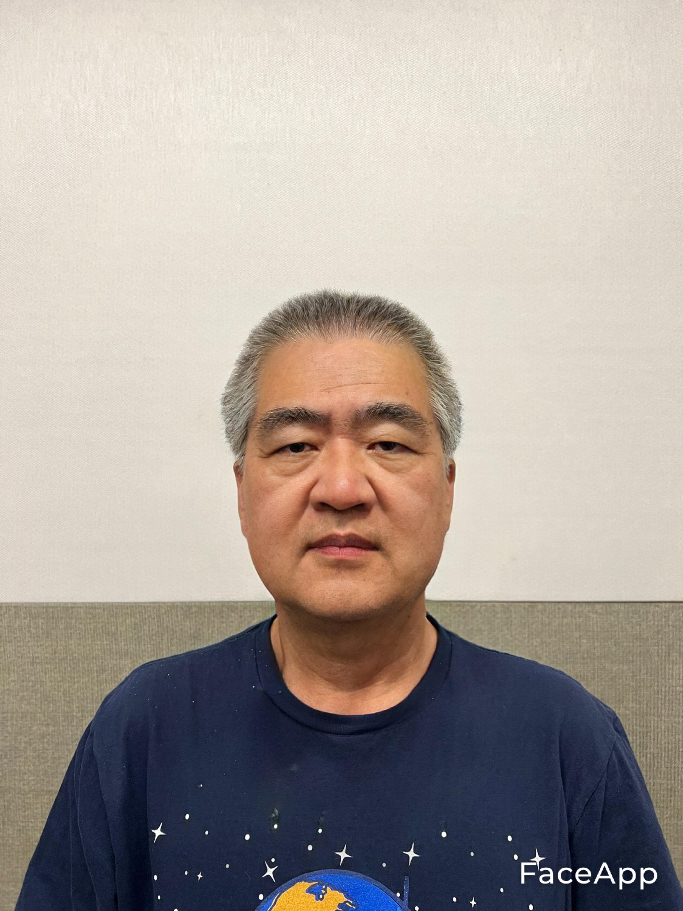

# SageVR

[Devpost Link](https://devpost.com/software/sagevr)

## Disclaimer

    The content provided by SageVR is for informational purposes only and is not intended to serve as professional advice. SageVR makes no representations or warranties of any kind, express or implied, about the completeness, accuracy, reliability, suitability, or availability with respect to the content provided.
    
    Any reliance you place on such information is therefore strictly at your own risk. In no event will SageVR be liable for any loss or damage including without limitation, indirect or consequential loss or damage, or any loss or damage whatsoever arising from loss of data or profits arising out of, or in connection with, the use of this website and its content.
    
    SageVR reserves the right to modify the content at any time without notice. The use of any information or materials on this website is entirely at your own risk, for which SageVR shall not be liable. It shall be your own responsibility to ensure that any products, services, or information available through this service meet your specific requirements.
    
    By using this service and its contents, you acknowledge that you have read this liability disclaimer and agree to its terms and conditions.

## Usage

This project will require an OpenAI API Key in order to work. Once the API key is obtained, go into the Assets folder and open the InteractionHandler script

Find the variable for the OpenAI API Key and input it. Once done, make sure to follow along with Meta docs to get the game loaded onto your Oculus VR.

## Pictures and Demo

[Demo](https://youtube.com/shorts/NSp8hhEe6v8?feature=share)

## Contributors

Abhinav Vemulapalli - @nandan.av (ChatGPT API and Integration/Text to Speech)
Hanmo Zhang - @adgnvtefc (Model & Prompt Engineering)
Tanya Garg - @tgag17 (Voice SDK)
Shivanee Jaiswal - @shivaneej (Scene devlopment and Voice SDK)
Siddhi Pandare - @pandaresiddhi (Scene development and Voice SDK)
Yousef Rajeh - @yousefrajeh (Hanmo model and Background Music, assistance with integration)
